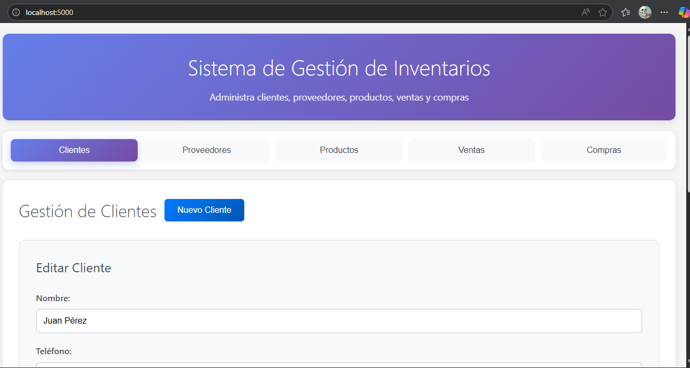

# Sistema de Gestión de Inventarios

Sistema completo de gestión de inventarios desarrollado con Python y Eel, que permite administrar clientes, proveedores, productos, ventas y compras a través de una interfaz web moderna.

##  Tabla de Contenidos

1. [Descripción General](#descripción-general)
2. [Arquitectura del Sistema](#arquitectura-del-sistema)
3. [Tecnologías Utilizadas](#tecnologías-utilizadas)
4. [Estructura del Proyecto](#estructura-del-proyecto)
5. [Instalación y Ejecución](#instalación-y-ejecución)
6. [Docker](#docker)
7. [Documentación del Código](#documentación-del-código)
8. [Funcionalidades](#funcionalidades)

---


##  Descripción General

Este sistema de inventarios es una aplicación web completa que facilita la gestión de:
- **Clientes**: Registro y administración de información de clientes
- **Proveedores**: Gestión de proveedores y empresas
- **Productos**: Catálogo de productos con control de stock
- **Ventas**: Registro de ventas con actualización automática de inventario
- **Compras**: Registro de compras a proveedores con actualización de stock

La aplicación utiliza una arquitectura **Modelo-Vista-Controlador (MVC)** para separar la lógica de negocio de la presentación.

---

##  Arquitectura del Sistema

### Patrón de Diseño: MVC (Modelo-Vista-Controlador)

```
┌─────────────┐         ┌──────────────┐         ┌─────────────┐
│   Vista     │ ←──────→│  Controlador │ ←──────→│   Modelo    │
│  (HTML/JS)  │         │   (Python)   │         │  (Python)   │
└─────────────┘         └──────────────┘         └─────────────┘
                                                          │
                                                          ↓
                                                  ┌──────────────┐
                                                  │  Database    │
                                                  │   (SQLite)   │
                                                  └──────────────┘
```

### Flujo de Datos

1. **Usuario** → Interactúa con la interfaz web (Vista)
2. **Vista** → Envía solicitud vía Eel al Controlador
3. **Controlador** → Valida datos y llama al Modelo
4. **Modelo** → Ejecuta operaciones en la base de datos
5. **Base de Datos** → Retorna resultados al Modelo
6. **Modelo** → Devuelve datos al Controlador
7. **Controlador** → Envía respuesta a la Vista
8. **Vista** → Actualiza la interfaz para el usuario

---

##  Tecnologías Utilizadas

### Backend
- **Python 3.11**: Lenguaje de programación principal
- **Eel 0.16.0**: Framework para crear aplicaciones web con Python y JavaScript
- **SQLite3**: Base de datos relacional ligera y embebida

### Frontend
- **HTML5**: Estructura de la interfaz
- **CSS3**: Estilos y diseño responsivo
- **JavaScript (ES6+)**: Lógica del cliente e interacción con Python

### Infraestructura
- **Docker**: Contenedorización de la aplicación
- **Docker Compose**: Orquestación de servicios

---

##  Estructura del Proyecto

```
inventario/
│
├── main.py                      # Punto de entrada de la aplicación
├── requirements.txt             # Dependencias de Python
├── inventario.db               # Base de datos SQLite (generada)
│
├── src/                        # Código fuente
│   ├── models/                 # Modelos de datos (Capa de acceso a BD)
│   │   ├── database.py         # Gestión de conexión y operaciones BD
│   │   ├── cliente.py          # Modelo de Cliente
│   │   ├── proveedor.py        # Modelo de Proveedor
│   │   ├── producto.py         # Modelo de Producto
│   │   ├── venta.py           # Modelo de Venta
│   │   └── compra.py          # Modelo de Compra
│   │
│   ├── controllers/            # Controladores (Lógica de negocio)
│   │   ├── cliente_controller.py
│   │   ├── proveedor_controller.py
│   │   ├── producto_controller.py
│   │   ├── venta_controller.py
│   │   └── compra_controller.py
│   │
│   └── views/                  # Interfaz de usuario
│       ├── index.html          # Página principal
│       ├── app.js             # Lógica del frontend
│       └── styles.css         # Estilos CSS
│
├── Dockerfile                  # Configuración de imagen Docker
├── docker-compose.yml          # Orquestación de contenedores
├── .dockerignore              # Archivos excluidos de Docker
├── .gitignore                 # Archivos excluidos de Git
└── README.MD                  # Este archivo
```

---

##  Instalación y Ejecución

### Prerequisitos
- Python 3.11 o superior
- pip (gestor de paquetes de Python)

### Instalación Local

1. **Clonar el repositorio**
```bash
git clone <url-del-repositorio>
cd inventario
```

2. **Instalar dependencias**
```bash
pip install -r requirements.txt
```

3. **Ejecutar la aplicación**
```bash
python main.py
```

4. **Acceder a la aplicación**
   - Abrir navegador en: `http://localhost:5000`

---

##  Docker

### ¿Por qué Docker?

Docker permite ejecutar la aplicación en un contenedor aislado, garantizando que funcione igual en cualquier entorno sin problemas de dependencias.

### Estructura de Archivos Docker

#### **Dockerfile**
Define cómo construir la imagen del contenedor:

```dockerfile
# Imagen base: Python 3.11 slim
FROM python:3.11-slim

# Directorio de trabajo
WORKDIR /app

# Instalar dependencias del sistema
RUN apt-get update && apt-get install -y gcc

# Copiar e instalar dependencias Python
COPY requirements.txt .
RUN pip install --no-cache-dir -r requirements.txt

# Copiar código de la aplicación
COPY . .

# Exponer puerto 5000
EXPOSE 5000

# Comando de inicio
CMD ["python", "main.py"]
```

**Explicación paso a paso:**
1. **FROM**: Usa imagen base de Python 3.11 optimizada
2. **WORKDIR**: Define `/app` como directorio de trabajo
3. **RUN**: Instala compilador gcc necesario para algunas dependencias
4. **COPY requirements.txt**: Copia solo el archivo de dependencias primero
5. **RUN pip install**: Instala paquetes Python (se cachea si no cambian)
6. **COPY . .**: Copia todo el código de la aplicación
7. **EXPOSE**: Declara que el contenedor escucha en puerto 5000
8. **CMD**: Comando que ejecuta al iniciar el contenedor

#### **docker-compose.yml**
Facilita la gestión del contenedor:

```yaml
version: '3.8'

services:
  inventario-app:
    container_name: sistema-inventarios
    build:
      context: .
      dockerfile: Dockerfile
    ports:
      - "5000:5000"
    volumes:
      - ./inventario.db:/app/inventario.db
    restart: unless-stopped
```

**Explicación de configuración:**
- **services**: Define los servicios del proyecto
- **container_name**: Nombre del contenedor
- **build**: Instrucciones para construir la imagen
- **ports**: Mapeo puerto host:contenedor (5000:5000)
- **volumes**: Persiste la base de datos fuera del contenedor
- **restart**: Reinicia automáticamente si falla

#### **.dockerignore**
Excluye archivos innecesarios del contenedor:

```
__pycache__/
*.pyc
.git/
.vscode/
.env
```

### Comandos Docker

#### Construir la imagen
```bash
docker build -t sistema-inventarios .
```

#### Ejecutar con Docker Compose (Recomendado)
```bash
# Iniciar la aplicación
docker-compose up -d

# Ver logs
docker-compose logs -f

# Detener la aplicación
docker-compose down
```

#### Ejecutar con Docker directamente
```bash
# Ejecutar contenedor
docker run -d -p 5000:5000 --name inventarios sistema-inventarios

# Ver logs
docker logs -f inventarios

# Detener contenedor
docker stop inventarios
```

### Ventajas de usar Docker

**Portabilidad**: Ejecuta en cualquier sistema con Docker  
**Aislamiento**: No afecta ni depende del sistema host  
**Reproducibilidad**: Misma configuración en desarrollo y producción  
**Escalabilidad**: Fácil de escalar con orquestadores como Kubernetes  

---

##  Documentación del Código

### 1. **main.py** - Punto de Entrada

```python
"""
Aplicación principal del sistema de inventarios.
Inicializa Eel, base de datos y controladores.
"""
```

**Responsabilidades:**
- Inicializar framework Eel con carpeta de vistas
- Crear instancia de base de datos
- Inicializar todos los controladores
- Exponer funciones Python a JavaScript con `@eel.expose`
- Iniciar servidor web en puerto 5000

**Funciones clave:**
- `eel.init('src/views')`: Configura carpeta de archivos web
- `eel.start()`: Inicia servidor con modo headless (`mode=False`)
- `@eel.expose`: Decorador que expone funciones a JavaScript

---

### 2. **src/models/database.py** - Gestor de Base de Datos

```python
"""
Módulo de gestión de base de datos SQLite.
Maneja conexiones y operaciones SQL.
"""
```

**Clase: Database**

| Método | Descripción | Parámetros | Retorna |
|--------|-------------|------------|---------|
| `__init__(db_path)` | Inicializa conexión | db_path: ruta BD | - |
| `connect()` | Conecta a SQLite | - | - |
| `create_tables()` | Crea tablas del sistema | - | - |
| `execute_query(query, params)` | Ejecuta INSERT/UPDATE/DELETE | query, params | Cursor o None |
| `fetch_all(query, params)` | Ejecuta SELECT múltiple | query, params | Lista de filas |
| `fetch_one(query, params)` | Ejecuta SELECT único | query, params | Fila o None |
| `close()` | Cierra conexión | - | - |

**Tablas creadas:**
1. **clientes**: id, nombre, teléfono, email, dirección, fecha_registro
2. **proveedores**: id, nombre, teléfono, email, dirección, empresa, fecha_registro
3. **productos**: id, nombre, descripción, precio, stock, id_proveedor, fecha_registro
4. **ventas**: id, id_cliente, id_producto, cantidad, precio_unitario, total, fecha_venta
5. **compras**: id, id_proveedor, id_producto, cantidad, precio_unitario, total, fecha_compra

---

### 3. **src/models/** - Modelos de Datos

Todos los modelos siguen el mismo patrón CRUD:

#### **cliente.py**
```python
"""
Modelo para gestionar operaciones con clientes.
"""
```

**Métodos:**
- `crear(nombre, telefono, email, direccion)`: Inserta nuevo cliente
- `obtener_todos()`: Lista todos los clientes ordenados
- `obtener_por_id(id)`: Busca cliente específico
- `actualizar(id, ...)`: Modifica datos de cliente
- `eliminar(id)`: Elimina cliente

#### **proveedor.py**
```python
"""
Modelo para gestionar proveedores y empresas.
"""
```
Misma estructura CRUD que Cliente, más campo `empresa`.

#### **producto.py**
```python
"""
Modelo para gestionar catálogo de productos.
"""
```
**Métodos adicionales:**
- `actualizar_stock(id, cantidad, operacion)`: Suma o resta stock
- `obtener_todos()`: JOIN con proveedores para mostrar empresa

#### **venta.py**
```python
"""
Modelo para registrar ventas.
Actualiza automáticamente el stock.
"""
```
**Lógica especial:**
- `crear()`: Calcula total y **reduce stock** del producto
- `eliminar()`: **Restaura stock** al eliminar venta

#### **compra.py**
```python
"""
Modelo para registrar compras a proveedores.
Actualiza automáticamente el stock.
"""
```
**Lógica especial:**
- `crear()`: Calcula total y **aumenta stock** del producto
- `eliminar()`: **Reduce stock** al eliminar compra

---

### 4. **src/controllers/** - Controladores

Los controladores añaden **validación de datos** antes de llamar a los modelos.

#### **cliente_controller.py**
```python
"""
Controlador de clientes con validación de negocio.
"""
```

**Validaciones:**
- Nombre obligatorio y no vacío
- Email con formato válido (contiene @)
- Normalización de texto (trim de espacios)

#### **Patrón común en todos los controladores:**

```python
class XController:
    def __init__(self, db):
        self.model = XModel(db)
    
    def crear_x(...):
        # 1. Validar datos de entrada
        # 2. Llamar al modelo
        # 3. Retornar resultado
```

**Ventajas:**
- Separación de responsabilidades
- Validación centralizada
- Reutilización del modelo
- Fácil testing

---

### 5. **src/views/** - Interfaz de Usuario

#### **index.html**
```html
<!-- Interfaz principal con 5 módulos -->
```

**Estructura:**
- Header con título
- Navegación por tabs (Clientes, Proveedores, Productos, Ventas, Compras)
- Formularios modales para crear/editar
- Tablas para mostrar datos
- Sistema de notificaciones

**Componentes clave:**
- Formularios con validación HTML5
- Tablas responsivas con acciones (Editar/Eliminar)
- Modal de confirmación para eliminaciones
- Sistema de notificaciones toast

#### **app.js**
```javascript
// Lógica del cliente con comunicación Python
```

**Funciones principales:**
- `showModule(nombre)`: Cambia entre módulos
- `cargarClientes()`: Llama a `eel.obtener_clientes()`
- `guardarCliente()`: Llama a `eel.crear_cliente()` o `eel.actualizar_cliente()`
- `eliminarCliente(id)`: Llama a `eel.eliminar_cliente()`

**Comunicación Eel:**
```javascript
// JavaScript → Python
eel.obtener_clientes()(function(clientes) {
    // Python → JavaScript (callback)
    renderizarTabla(clientes);
});
```

#### **styles.css**
```css
/* Estilos modernos y responsivos */
```

**Características:**
- Variables CSS para colores consistentes
- Diseño responsivo con Flexbox/Grid
- Animaciones suaves
- Tema morado/azul profesional

---

##  Funcionalidades

### Gestión de Clientes
-  Crear cliente con validación
-  Listar todos los clientes
-  Editar información de cliente
-  Eliminar cliente
-  Validación de email

### Gestión de Proveedores
-  Registrar proveedor con empresa
-  Listar proveedores
-  Actualizar datos de proveedor
-  Eliminar proveedor

### Gestión de Productos
-  Crear producto con relación a proveedor
-  Control de stock en tiempo real
-  Actualización de precios
-  Visualización de proveedor en listado

### Gestión de Ventas
-  Registrar venta
-  Cálculo automático de total
-  **Reducción automática de stock**
-  Validación de stock disponible
-  Historial de ventas
-  Restauración de stock al eliminar

### Gestión de Compras
-  Registrar compra a proveedor
-  Cálculo automático de total
-  **Incremento automático de stock**
-  Historial de compras
-  Ajuste de stock al eliminar

---

##  Seguridad

-  Consultas parametrizadas (previene SQL Injection)
-  Validación de datos en controladores
-  Manejo de errores con try/except
-  Mensajes de error sin información sensible

---
##  Preview

---

**Desarrollado con ❤️ usando Python y Eel**
